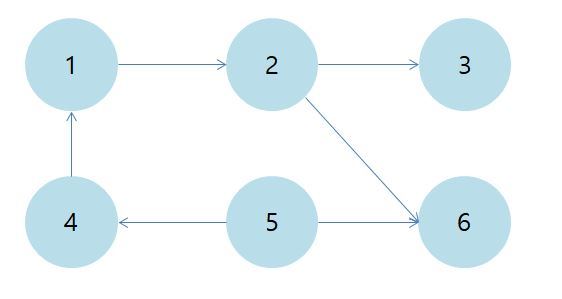
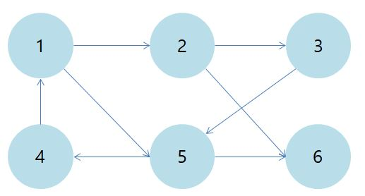

위상 정렬
-------------
1. 위상정렬 개념

+ 비순환 방향 그래프(Directed Acyclic Graph : DAG)
 - 사이클(순환)이 없는 방향 그래프 
 - 이벤트 간의 우선순위를 나타낼 때 사용 

 - cf) 사이클(순환)이 있는 방향 그래프 
  
   
+ 위상정렬 정의
 - DAG(비순환 방향 그래프)의 각 정점을 선형으로 정렬하는 것
 - DAG가 아닌 경우 그래프에 대한 위상정렬 불가능 -> 사이클이 있으면 각 정점의 순서를 정할 수 없음
 - 위상정렬을 설명하는 예로 수강신청이 많이 등장   선수과목이 있다면 선수과목을 먼저 수강하고 그 과목을 수강해야 하는데, 이때 그 과목을 수강하기 위한 선수과목들의 정렬을 예로 들 수 있음 
 - 위 비순환 방향 그래프의 예시를 위상정렬을 통해 선형으로 나타내면 다음의 이미지로 설명할 수 있음 
  
   
+ 위상정렬의 구현
 - BFS를 이용한 구현

