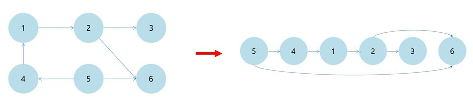

위상 정렬
-------------
# 위상정렬 개념

## 비순환 방향 그래프(Directed Acyclic Graph : DAG)
 - 사이클(순환)이 없는 방향 그래프 
 - 이벤트 간의 우선순위를 나타낼 때 사용 

 - cf) 사이클(순환)이 있는 방향 그래프 
  
   
## 위상정렬 정의
 - DAG(비순환 방향 그래프)의 각 정점을 선형으로 정렬하는 것
 - DAG가 아닌 경우 그래프에 대한 위상정렬 불가능 -> 사이클이 있으면 각 정점의 순서를 정할 수 없음
 - 위상정렬을 설명하는 예로 수강신청이 많이 등장   선수과목이 있다면 선수과목을 먼저 수강하고 그 과목을 수강해야 하는데, 이때 그 과목을 수강하기 위한 선수과목들의 정렬을 예로 들 수 있음 
 - 위 비순환 방향 그래프의 예시를 위상정렬을 통해 선형으로 나타내면 다음의 이미지로 설명할 수 있음 
  
   
## 위상정렬의 구현
### DFS를 이용한 구현
<0> 연결 리스트에 노드 간 연결 정보를 정리, 방문 순서를 저장할 리스트 P선언 
<1> 하나의 정점에서 시작 
<2> 방문 표시를 하면서 해당 노드를 Stack에 넣고, 간선을 따라 다음 정점으로 이동 
<3> 더 방문할 곳이 없으면 리스트 P의 **앞**에 정점을 추가 
<4> Stack이 비었을 경우에는 백트래킹을 통해 아직 방문하지 않은 노드를 Stack에 추가하고, <1>부터 <3>까지의 과정 반복   
### BFS를 이용한 구현
<0> 진입차수를 저장하기 위한 리스트를 선언하고, 연결 리스트에 노드 간 연결 정보 정리. 방문 순서를 저장할 리스트 P선언 
<1> **진입차수가 0**인 노드는 **방문한 것으로 표시**하고, 큐에 추가 
<2> 큐에서 가장 앞 노드를 P에 추가하고, 연결된 노드 중 방문하지 않은 노드의 진입차수를 1감소 
<3> 감소한 진입차수가 0인 경우 해당 노드를 큐에 넣고, 방문 표시. 위 <2>부터 <3>까지 과정을 큐가 빌 때까지 반복 수행 
