# BOJ15989
[문제링크](https://www.acmicpc.net/problem/15989 "문제 링크")<br>
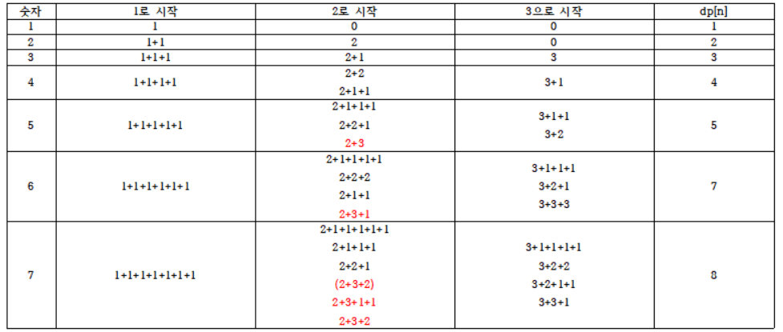<br>
접근한 방법<br>
1. 문제에서 주어진 숫자를 각각 1로 시작하는 수의 조합, 2로 시작하는 수의 조합, 3으로 시작하는 수의 조합으로 분류
2. 위 표와 같이 1로 시작하는 숫자의 경우 바로 *1번 이전의 숫자*의 *1로 만들 수 있는 숫자 조합*에 1을 추가한 것이기 때문에 1로 시작하는 숫자의 경우의 수는 어떤 수든 1
3. 2로 시작하는 숫자의 경우 현재 숫자의 2번 이전의 숫자에 2를 더한 것으로 생각할 수 있는데, 이때 위 표에서 2로 시작하는 수의 조합과 3으로 시작하는 수의 조합이 겹치는 것을 볼 수 있음.(빨간색으로 표시된 부분)<br>
   문제에서는 같은 수로 구성되어 있고 순서만 다른 경우를 같은 경우로 본다고 했기 때문에 중복된 것을 빼줘야 하는데<br>
   이때, 2로 시작하는 숫자는 2번 이전의 숫자의 dp 중에서 1로 시작하는 숫자, 2로 시작하는 숫자의 경우만 더해주어야 중복을 피할 수 있음.
4. 즉, 1로 시작하는 숫자의 조합은 dp[n-1] 값들 중 1로 시작하는 숫자의 경우의 수만 더해주고, 2로 시작하는 숫자는 dp[n-2]의 1, 2로 시작하는 숫자, 3으로 시작하는 숫자는 dp[n-3]의 1, 2, 3으로 시작하는 숫자의 경우의 수만 더해주어야 중복을 피할 수 있음.<br>
   -> i(1<= i <= 3)로 시작하는 숫자를 만들기 위해서는 dp[n-i]의 값 중 i이하의 숫자로 만들 수 있는 경우의 수 합을 구해준다.
5. 문제에서 입력 n은 1만 이하의 숫자라고 했으므로 dp를 [0, 0, 0, 0] * 10001개 만들어주고, dp[n][i]를 n을 i로 시작하는 숫자로 만들 수 있는 경우의 수로 정의
6. 또한, 시간초과를 막기 위해서 입력 n이 이미 계산된 dp값이라면 바로 출력하도록 tmp 변수에 n의 최대값을 저장하도록 함.(31번째 줄)<br><br>

정답 코드

```python
# https://www.acmicpc.net/problem/15989
def solution(n):
    for nn in range(tmp+1, n+1):
        if nn == 1:
            dp[1][1] = 1
            continue
        if nn == 2:
            dp[2][1] = 1
            dp[2][2] = 1
            continue
        if nn == 3:
            dp[3][1] = 1
            dp[3][2] = 1
            dp[3][3] = 1
            continue
        dp[nn][1] = dp[nn-1][1]
        dp[nn][2] = dp[nn-2][1] + dp[nn-2][2]
        dp[nn][3] = dp[nn-3][1] + dp[nn-3][2] + dp[nn-3][3]
    return sum(dp[n])

T = int(input().rstrip())
tmp = 0
dp = [[0, 0, 0, 0] for _ in range(10000+1)]
for _ in range(T):
    n = int(input().rstrip())

    if n > tmp:
        print(solution(n))
    else:
        print(sum(dp[n]))
    tmp = max(n, tmp)
```

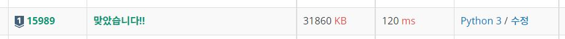<br><br>


# BOJ1495
[문제링크](https://www.acmicpc.net/problem/1495 "문제 링크")<br>
접근한 방법<br>
1. dp 정의 : dp[songs][volume] = songs 번째의 곡을 연주할 때 volume을 만들 수 있는가 ? 만들 수 있으면 1, 만들 수 없으면 0
2. dp[0]에서 시작 볼륨의 값을 1로 설정<br>
   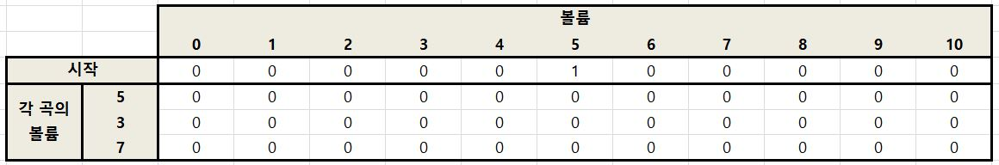<br><br>
3. 문제에서 주어진 조건에 의해 다음 연주하는 곡의 볼륨은 +/- 5이므로, dp[0][startv]에서 +5 혹은 -5 했을 때의 볼륨이 조건에 맞는 값이라면 dp[1]에서 해당하는 값을 1로 변경<br>
   이 경우는 dp[1][0] 과 dp[1][10]을 만들 수 있음<br>
   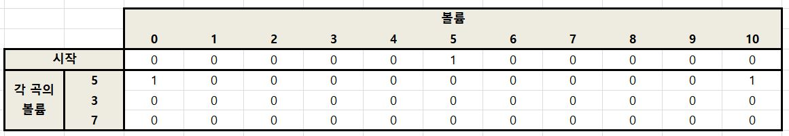<br><br>
4. 3번에서 수행한 방법과 동일하게 dp[1]의 값으로부터 +/- 3을 했을 때 만들 수 있는 볼륨 중 13 과 -3은 조건에 맞지 않으므로 제외하고, 조건에 맞는 값만 표시하면 dp[2][3], dp[2][7]<br>
   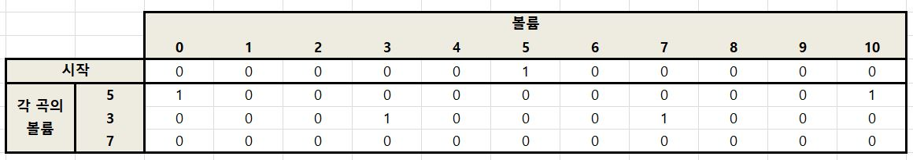<br><br>
5. 같은 방법으로 마지막 곡에 대해서도 표시하면 아래와 같은 결과<br>
   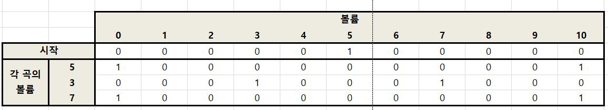<br><br>
6. 계산된 dp에서 마지막 곡을 연주했을 때의 최대값을 찾아야 하기 때문에 dp[songs] 중에서 값이 1인 인덱스로 역순으로 조회하고, 없다면 -1을 출력<br><br>

정답 코드

```python
# https://www.acmicpc.net/problem/1495

songs, startv, maxv = map(int, input().split())
v = list(map(int, input().split()))
dp = [[0 for _ in range(maxv + 1)] for _ in range(songs+1)]

dp[0][startv] = 1
for i in range(1, songs+1):
    for ii in range(maxv+1):
        if dp[i-1][ii] == 1:
            if ii + v[i-1] <= maxv:
                dp[i][ii + v[i-1]] = 1
            if ii - v[i-1] >= 0:
                dp[i][ii - v[i-1]] = 1
ans = -1
for d in range(maxv, -1, -1):
    if dp[songs][d] == 1:
        ans = d
        break
print(ans)
```

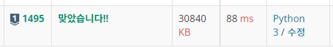<br><br>


# BOJ11058
[문제링크](https://www.acmicpc.net/problem/11058 "문제 링크")<br>
접근한 방법<br>
1. dp 정의 : dp[n] = n번째 동작을 했을때 출력할 수 있는 문자의 갯수 중 가장 큰 값
2. dp[1]은 이전에 출력된 문자가 없고 따라서 복사+붙여넣기로 문자를 생성할 수 있는 방법이 없기 때문에 최대값은 1
3. 각 dp[n]을 채울 수 있는 방법은 다음과 같다
   - 이전 문자에서 한글자 더 타이핑 하는 경우 : dp[n-1] + 1
   - 3번째 전 문자를 복사+붙여넣기 하는 경우 : dp[n-3] * 2 (3번째 전 문자열을 "선택, 복사, 붙여넣기" 하는 과정을 거쳐야하므로 새로 추가되는 문자열은 없고, "선택, 복사, 붙여넣기" 후에 새로 추가되는 문자열은 3번째 전 문자열의 길이 * 2)
   - 4번째 전 문자를 복사+붙여넣기 하는 경우 : dp[n-4] * 3 (4번째 전 문자를 복사하면 그 값은 버퍼에 계속 남게 되므로 두번 연달아 복사)
   - 인덱스가 증가할 수록 이전 dp[n] - dp[n-1] 의 값이 커짐(기울기가 양수)이므로 dp[n-k] * (k-1)을 매우 작은 값까지 계산하고 비교하는 것은 의미가 없다고 생각하여 dp[n-6]*5 까지의 값만 비교
4. 코드를 실행하여 dp 배열을 확인한 결과 1~6번째 값은 인덱스와 값이 동일하기 때문에 아래의 if문처럼 dp값을 계산함(6번째 줄)<br><br>

정답 코드

```python
# https://www.acmicpc.net/problem/11058

N = int(input().rstrip())
dp = [0 for _ in range(N+1)]
for n in range(1, N+1):
    if n <= 6:
        dp[n] = n
        continue
    dp[n] = max(dp[n - 3] * 2, dp[n - 4] * 3, dp[n - 5] * 4, dp[n-6]*5, dp[n - 1] + 1)
print(dp[-1])
```

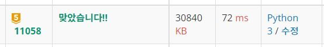<br><br>


# BOJ12026
[문제링크](https://www.acmicpc.net/problem/12026 "문제 링크")<br>
접근한 방법<br>
1. dp 정의 : dp[n] = n번째 위치까지 오는 경우 중에 가장 작은 에너지를 소모하는 경우<br>
   그리고 dp의 값을 10^8 로 초기화하고, 실행 종료 후에도 여전히 값이 10^8인 경우 밟지 않은 길로 간주하였다.
2. dp[1]은 무조건 밟아야 하기 때문에 1
3. 각 n번째 위치를 밟기 위해서는 B->O->J->B->O ... 순서를 만족해야 하기 때문에 현재 현재 위치의 인덱스를 저장해주고(8~15번째 줄), 현재 위치 이전의 길을 for문을 통해 탐색하면서 현재 위치 인덱스보다 하나 이전 문자인지 확인해주었다(18번째 줄)
4. 위 3번의 조건을 만족하는 길을 찾게 된다면, 현재 돌까지 오는데 소모되는 에너지의 최소값을 찾아주고(19번째 줄), 그 값으로 dp를 갱신했다.
5. 실행 완료 후에 목적지의 dp값을 확인하여 10^8이 아니라면 그 값을 출력하고, 맞다면 도달하지 못한 것으로 간주하여 -1을 출력<br>
   마지막에 dp값에서 1을 뺀 이유는 첫 번째 돌에서부터 출발한 것이라 dp[1] 값은 원래는 0이기 때문에 마지막 값에서 1을 빼줌<br><br>

정답 코드

```python
# acmicpc.net/problem/12026
n = int(input().rstrip())
road = input().rstrip()
dp = [int(10e8) for _ in range(n+1)]
dp[1] = 1
order = ['B', 'O', 'J']
for d in range(2, n+1):
    idx = 0
    if road[d-1] == 'O':
        idx = 1
    elif road[d-1] == 'J':
        idx = 2
    idx_t = (idx - 1)
    if idx_t == -1:
        idx_t = 2
    val = int(10e8)
    for dd in range(1, d):
        if road[dd-1] == order[idx_t]:
            val = min(val, dp[dd]+((d-dd)**2))
    dp[d] = val
if dp[-1] != int(10e8):
    print(dp[n]-1)
else:
    print(-1)
```

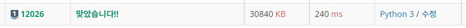<br><br>


# BOJ12865
[문제링크](https://www.acmicpc.net/problem/12865 "문제 링크")<br>
접근한 방법 : Knapsack 알고리즘<br>
[어떻게 풀어야할지 몰라서 삽질하고 있을 때 도움이 된 감사한 블로그 링크](https://hongcoding.tistory.com/50 "도움이 된 블로그 링크")<br>
1. dp 정의 : dp[n][kg] = 각 무게 이하로 담기까지 가방에 n번째 짐을 담을 때의 가치 중 최대
2. dp[n][kg] 만드는 방법은<br>
   - n번째 짐을 담았을 때 현재 kg를 초과한다면 담지 않음
      - 즉, 이전에 담았던 짐의 가치와 동일한 가치를 갖게 되므로 dp[n][kg] = dp[n-1][kg]
   - n번째 짐을 담았을 때 현재 kg를 초과하지 않는다면 아래의 경우 중 최대의 가치를 선택
      - 현재 담을 무게만큼을 빼고, 지금 물건을 담는다 : dp[n][kg] = dp[n-1][kg-현재물건의 무게] + 현재 물건의 가치<br>
        이 과정에서 현재 무게와 동일한 짐에 대해 무게 당 가치가 더 큰 물건으로 대체된다 
      - 물건을 담지 않는다 : dp[n][kg] = dp[n-1][kg]
3. 위 과정을 거치고 n번째 짐에 대한 값까지 계산이 끝났을 때 dp[n][-1]을 출력<br>
   물건을 담지 않는 경우는 dp[n][kg] 에 dp[n-1][kg]를 대입했기 때문에 가장 마지막 값을 출력하더라도 결과에 오류가 없음<br><br>


정답 코드

```python
# https://www.acmicpc.net/problem/12865
n, kg = map(int, input().split())
dp = [[0 for _ in range(kg+1)] for _ in range(n+1)]
load = [[0, 0]]
for nn in range(n):
    l, v = map(int, input().split())
    load.append((l, v))

for nn in range(1, n+1):
    for kk in range(1, kg+1):
        if kk < load[nn][0]:
            dp[nn][kk] = dp[nn-1][kk]
        else:
            dp[nn][kk] = max(dp[nn-1][kk], dp[nn-1][kk-load[nn][0]] + load[nn][1])
print(dp[n][-1])
```

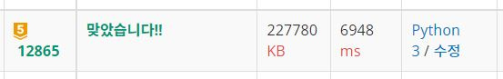<br><br>


# BOJ5557
[문제링크](https://www.acmicpc.net/problem/5557 "문제 링크")<br>
접근한 방법
1. dp 정의 : dp[n][num] = 주어진 숫자 중 n번째 수를 더하거나 빼서 num을 만들 수 있는 경우의 수
2. dp[n][num] 만드는 방법을 문제의 [8 3 2 4 8 7 2 4 0 8 8] 예제로 설명하면<br>
   - 1번째 숫자 8을 이용해 8을 만드는 방법은 1가지이므로 dp[1][8] = 1로 초기화
   - 2번째 숫자를 더하거나 빼는 경우를 계산하기 위해서는 이전의 단계에서 0이 아닌 값을 찾고(0이 아니라는 것은 더하거나 빼서 그 숫자를 만들 수 있다는 의미이기 때문에)
    - 이 경우는 3을 더하거나 빼서 만들 수 있는 수는 5, 11이기 때문에 dp[2][5] += dp[1][8], dp[2][11] += dp[1][8]
    - 처음에 시도했을 때는 단순히 11, 14번째 줄과 같이 1만 더해주었는데, 이렇게 하면 앞선 경우의 수를 모두 포함하는 결과가 아니기 때문에 결과에 오류 발생
3. 위 과정을 거치고 n-1번째 수까지 더하거나 뺀 뒤의 결과와 n번째 숫자(예제에서는 8)와의 등식이 성립하는 dp[n-1][문제에 주어진 숫자의 가장 마지막 수] 의 결과를 출력<br><br>


정답 코드

```python
# https://www.acmicpc.net/problem/5557
n = int(input().rstrip())
nums = list(map(int, input().split()))
nums = [0] + nums
dp = [[0 for _ in range(21)] for _ in range(n)]
dp[1][nums[1]] = 1
for i in range(2, n):
    for j in range(21):
        if dp[i-1][j] != 0:
            if 0 <= j + nums[i] <= 20:
                dp[i][j + nums[i]] += dp[i-1][j]
                #dp[i][j + nums[i]] += 1
            if 0 <= j - nums[i] <= 20:
                dp[i][j - nums[i]] += dp[i-1][j]
                #dp[i][j - nums[i]] += 1
print(dp[n-1][nums[-1]])
```

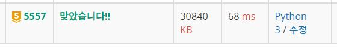<br><br>