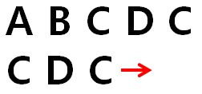
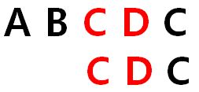
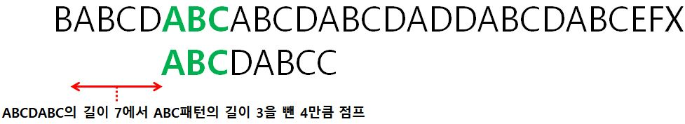

# KMP 개념

## 접두사와 접미사
 - ABCDC 에서 접두사는  A  AB  ABC  ABCD  ABCDC
 - ABCDC 에서 접미사는  C  DC  CDC  BCDC  ABCDC 

|길이  |접두사  |접미사  |
|:---:|:-----:|:-----:|
|1    |A      |C      |
|2    |AB     |DC     |
|3    |ABC    |CDC    |
|4    |ABCD   |BCDC   |
|5    |ABCDC  |ABCDC  |

## 일반적인 방법으로 문자열 탐색하기
 
찾으려는 문자가 CDC라고 할 때, 첫 문자를 비교하여 일치하지 않으므로 오른쪽으로 한 칸 시프트 
 
역시 첫 문자를 비교하여 일치하지 않으므로 한 칸 시프트 
 
첫 문자를 비교하여 일치하는 부분을 찾음 
 
이어서 바로 이웃한 옆 문자를 비교하여 일치하는 것을 확인 
 
바로 그 다음 문자도 비교하여 일치하는 것을 확인. 이런 과정을 통해 ABCDC에서 CDC를 찾을 수 있음 
   
## KMP 알고리즘 : 패턴 매칭 이용
### 패턴을 먼저 정의
- 예를 들어 문자열이 BABCDABCABCDABCDADDABCDABCEFX 이고 찾아야 할 문자열이 ABCDABCC 라고 할 때
- 처음에는 일반적인 방법으로 일치하는 문자열을 아래와 같이 ABCDABC를 찾았다고 할 때 이에 대한 패턴을 찾아줌 
 
  아래와 같이 찾은 패턴의 길이는 3인데, 위 경우와 다르게 2개 이상의 패턴을 찾는다면 가장 큰 값을 패턴 값으로 정해준다
  
|패턴길이|접두사|접미사|
|:---:|:-----:|:-----:|
|0    |A      |C      |
|0    |AB     |BC     |
|3    |ABC    |ABC    |
|0    |ABCD   |DABC   |
|0    |ABCDA  |CDABC  |
|0    |ABCDAB  |BCDABC  |

- 문자열이 일치하지 않기 때문에 다음 인덱스를 탐색해야 하는데, 이때 일반적인 방식과 다른 점은 한 칸씩 시프트 하지 않는다는 점
- 위 표와 같이 찾은 문자열의 접두사와 접미사가 *ABC*로 일치한다는 것을 찾았기 때문에 탐색 인덱스는 다음 ABC부터 탐색을 이어간다 
 
즉, *찾은 문자열의 길이* - *일치하는 패턴의 길이* = 7 - 3 = 4 만큼 점프하여 탐색을 이어간다 
- 이어서 다음 탐색을 진행하는데 이때 일치하는 문자는 A 하나뿐이기 때문에 
 
  아래와 같이 1칸만 이동하는데 이 값은 *찾은 문자열의 길이* - *일치하는 패턴의 길이* = 1 - 0 = 1 에 의해 계산된 값 
 
- 하지만 이런 방식으로 매번 일치하는 부분을 찾으면 실행 시간이 오래 걸리기 때문에 KMP 알고리즘의 장점을 살릴 수 없으므로 패턴 길이에 대한 표를 미리 정의한다 

|일치하는 문자열|일치하는 문자열의 길이|일치하는 패턴의 길이 *최댓값*|이동시킬 인덱스|
|:--------:|:--------:|:--------:|:--------:|
|일치하는 문자 없음|0|0|"찾은 문자열 길이" - "일치하는 패턴 길이" = 1  이 나와야 하므로 *-1*로 초기화
|A|1|0|1 - 0 = 1|
|AB|2|0|2 - 0 = 2|
|ABC|3|0|3 - 0 = 3|
|ABCD|4|0|4 - 0 = 4|
|ABCDA|5|1|5 - 1 = 4|
|ABCDAB|6|2|6 - 2 = 4|
|ABCDABC|7|3|7 - 3 = 4|
|ABCDABCC|8|8|8 - 8 = 0|

- 위 표와 같이 이동거리를 미리 계산해놓고, 각 탐색마다 계산된 인덱스만큼 점프한다면 신속하게 문자열을 탐색할 수 있음 
  (예) 일치하는 문자열이 7개라면 위 표로부터 이동할 인덱스는 4, 일치하는 문자열이 3이라염 위 표로부터 이동할 인덱스는 3 