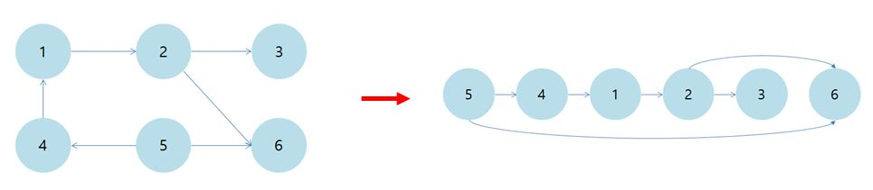
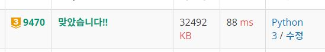

# KMP 개념

## 접두사와 접미사
 - ABCDC 에서 접두사는<br> A<br> AB<br> ABC<br> ABCD<br> ABCDC
 - ABCDC 에서 접미사는<br> C<br> DC<br> CDC<br> BCDC<br> ABCDC<br>
|길이|접두사|접미사|
|:---:|:-----:|:-----:|
|1|A|C|
|2|AB|DC|
|3|ABC|CDC|
|4|ABCD|BCDC|
|5|ABCDC|ABCDC|
   
## 일반적인 방법으로 문자열 탐색하기
 - DAG(비순환 방향 그래프)의 각 정점을 선형으로 정렬하는 것
 - DAG가 아닌 경우 그래프에 대한 위상정렬 불가능 -> 사이클이 있으면 각 정점의 순서를 정할 수 없음
 - 위상정렬을 설명하는 예로 수강신청이 많이 등장<br>  선수과목이 있다면 선수과목을 먼저 수강하고 그 과목을 수강해야 하는데, 이때 그 과목을 수강하기 위한 선수과목들의 정렬을 예로 들 수 있음<br>
 - 위 비순환 방향 그래프의 예시를 위상정렬을 통해 선형으로 나타내면 다음의 이미지로 설명할 수 있음<br>
<br><br>
   
## 위상정렬의 구현
### DFS를 이용한 구현
<0> 연결 리스트에 노드 간 연결 정보를 정리, 방문 순서를 저장할 리스트 P선언<br>
<1> 하나의 정점에서 시작<br>
<2> 방문 표시를 하면서 해당 노드를 Stack에 넣고, 간선을 따라 다음 정점으로 이동<br>
<3> 더 방문할 곳이 없으면 리스트 P의 **앞**에 정점을 추가<br>
<4> Stack이 비었을 경우에는 백트래킹을 통해 아직 방문하지 않은 노드를 Stack에 추가하고, <1>부터 <3>까지의 과정 반복<br><br><br>
### BFS를 이용한 구현
<0> 진입차수를 저장하기 위한 리스트를 선언하고, 연결 리스트에 노드 간 연결 정보 정리.<br>방문 순서를 저장할 리스트 P선언<br>
<1> **진입차수가 0**인 노드는 **방문한 것으로 표시**하고, 큐에 추가<br>
<2> 큐에서 가장 앞 노드를 P에 추가하고, 연결된 노드 중 방문하지 않은 노드의 진입차수를 1감소<br>
<3> 감소한 진입차수가 0인 경우 해당 노드를 큐에 넣고, 방문 표시.<br>위 <2>부터 <3>까지 과정을 큐가 빌 때까지 반복 수행<br><br>

# BOJ9470
[문제링크](https://www.acmicpc.net/problem/9470 "문제 링크")
처음에 시도한 잘못된 코드

~~~python
from collections import deque

T = int(input().rstrip())

def make_list(st, ed):
    in_degree[ed] += 1      # 진입 차수 계산

def solution(q):
    while q:
        start, order = q.popleft()
        vis.append(start)
        for n in l_list[start]:
            in_degree[n] -= 1
            if tmp[n] == order:
                tmp[n] += 1
            else:
                tmp[n] = max(tmp[n], order)
            if n not in vis and in_degree[n] == 0:
                q.append((n, tmp[n]))

for _ in range(T):
    K, M, P = map(int, input().split())
    in_degree = [0 for _ in range(M + 1)]
    tmp = [0 for _ in range(M + 1)]
    for _ in range(P):
        st, ed = map(int, input().split())
        make_list(st, ed)
    q = deque()
    for m in range(1, M + 1):
        if in_degree[m] == 0:
            tmp[m] = 1
            q.append((m, tmp[m]))

    solution(q)
    print(K, tmp[M])
~~~

처음에 접근한 방법<br>
1. 각 노드의 진입차수를 계산 : make_list() 함수
2. 각 노드의 순서를 계산하기 위해 tmp 리스트를 선언하고, 진입차수가 0인 노드는 순서롤 1로 갱신
3. 노드와 순서를 pair로 큐에 삽입하고, solution 함수 호출
4. 큐의 왼쪽에서 pop하고 방문표시를 한 후에 진입차수 1 감소
5. 현재 노드의 연결 리스트를 돌면서, 연결된 노드의 순서와 현재 노드의 순서를 비교. 순서가 같으면 1 증가시키고, 다르면 더 큰 값으로 순서를 갱신
6. 연결된 노드와 갱신된 순서를 pair로 하여 큐에 삽입
7. 큐가 빌 때까지 4~6 과정 반복 <br><br>

정답 코드

```python
from collections import deque

T = int(input().rstrip())

def make_list(st, ed):
    in_degree[ed] += 1      # 진입 차수 계산
    l_list[st].append(ed)   # start -> end 연결 리스트
    src[ed].append(st)      # end <- start 연결 리스트 : 노드가 어디로부터 연결되어있는지 확인하기 위한 리스트

def solution(q):            # 위상정렬 결과를 p에 저장해주는 함수
    while q:
        start, order = q.popleft()
        vis.append(start)
        p.append(start)
        for n in l_list[start]:
            in_degree[n] -= 1
            if n not in vis and in_degree[n] == 0:
                q.append((n, order+1))

def solution2(q):
    solution(q)
    for pp in p:
        if len(src[pp]) != 0:                       # src[pp]의 길이가 0이면 그대로 순서를 1로 둠
            for s in src[pp]:                       # 도착지가 pp인 노드(src[pp]의 원소)를 확인하면서
                if tmp[pp] != tmp[s]:                        
                    tmp[pp] = max(tmp[pp], tmp[s])  # 순서 tmp[pp]를 각 노드의 순서들 중 최댓값으로 갱신하거나      
                else:
                    tmp[pp] += 1                    # 혹은 그 순서가 2개 이상이라면 1을 추가
    return tmp[p[-1]]                               # 도착 노드의 순서를 리턴

for _ in range(T):
    K, M, P = map(int, input().split())
    in_degree = [0 for _ in range(M + 1)]
    l_list = [[] for _ in range(M + 1)]
    tmp = [0 for _ in range(M + 1)]
    src = [[] for _ in range(M + 1)]
    p = deque()
    for _ in range(P):
        st, ed = map(int, input().split())
        make_list(st, ed)
    q = deque()
    for m in range(1, M + 1):
        if in_degree[m] == 0:
            tmp[m] = 1
            q.append((m, tmp[m]))
    print(K, solution2(q))
```

처음 방법으로 답을 제출했을 때 오답처리가 발생하여 위 코드로 다시 제출.<br>
오류가 발생한 이유는 현재 노드와 연결된 노드를 그때마다 값을 갱신하면서 값에 오류가 발생<br>
따라서 src라는 리스트를 선언하고, 임의 노드가 어떤 노드로부터 출발하였는지 도착지 중심으로 연결리스트 작성<br>
그리고 위상정렬 된 값을 순서대로 돌면서 노드가 어떤 노드로부터 왔는지 확인하고, 그 노드들 중 순서 i의 최대값으로 현재 노드의 순서를 갱신(단, 2개 이상이면 i+1 로 갱신)<br>
<br><br>