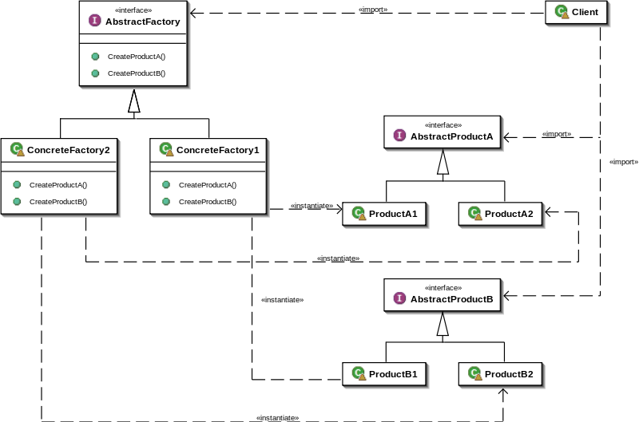

# Design Pattern
1. 분류
- Creational Pattern(생성 패턴)
  - 객체 생성에 관련된 패턴
  - 객체의 생성과 조합을 캡슐화 하여 특정 개체가 생성되거나 변경되어도 프로그램 구조에 영향을 크게 받지 않도록 유연성 제공
- Structural Pattern(구조 패턴)
  - 클래스나 객체를 조합해 더 큰 구조를 만드는 패턴
  - 서로 다른 인터페이스를 지닌 2개의 객체를 묶어 단일 인터페이스 제공하거나 객체들을 서로 묶어 새로운 기능 제공
- Behavioral Pattern(행위 패턴)
  - 객체나 클래스 사이의 알고리즘이나 책임 분배에 관련된 패턴
  - 한 객체가 혼자 수행할 수 없는 작업을 여러 개의 객체로 어떻게 분배하는지, 그리고 그렇게 하면서도 객체 사이의 결합도를 최소화(느슨한 결합)하는 것에 중점을 둔다<br><br>
  
## Creational Pattern(생성 패턴)
1. Singleton Pattern(싱글턴 패턴)
- 특징
    - 사용하는 객체를 Static으로 선언 -> 해당 객체의 메모리를 정적할당 하면서 하나의 객체에만 접근
    - 다른 곳에서 새롭게 생성자 선언하더라도, 이미 정적 선언된 객체가 반환되므로 중복 선언 방지
- 장점
    - 매우 단순한 구조
    - 모든 데이터에 전역으로 접근 및 관리가 가능
- 단점
    - 정적 메모리에 할당된 객체이므로 해당 객체에 너무 큰 메모리 쌓이게 되면 성능이 저하
    - 따라서 복잡한 프로그램에 이 패턴을 사용하는 경우 효율이 떨어지고<br>서로 다른 데이터를 공유하게 되면 다른 객체들과 결합도가 떨어지게 됨
- 구현

```c#
pravate class Singleton {
    private static Singleton stc_singleton;     // 정적 객체 선언
    public static Singleton Instance() {
        if (stc_singleton == null)
            stc_singleton = new Singleton();    // stc_singleton 객체의 중복선언을 방지
        return stc_singleton;
    }
}

static void Main(string[] args){
    var objectA = Singleton.Instance();
    var objectB = Singleton.Instance();         // objectA, B 모두 동일한 객체
}
```

<br><br>
2. Factory Method Pattern(팩토리 메서드 패턴)
- 특징
    - 해당 클래스를 상속받은 클래스에 객체 생성 방법을 명시. 즉, 생성자를 사용해 객체를 생성하지 않고 그 기능을 파생 클래스에 위임
    - 프로그램의 구조가 잡힌 상태에서 여러사람이 협업하면서 각각의 파생 클래스를 구현하는 것이 가능한 구조
    - 기능의 추가/변경 시 객체 생성코드를 유연하게 변경 가능
- 구현

```c#
// Product 클래스 구현
public abstract class Behave
{
    public abstract void run();
}

// ConcreteProduct 클래스 구현
public class Dog : Behave
{
public int NumOfLeg;
public override void run()
{ System.out.println("Dog is running"); }
}
      
public class Cat : Behave
{
public int Height;
public override void run()
{ System.out.println("Cat is running"); }
} 

// Creator 클래스 구현
public abstract class BehaveCreator
{
    public abstract BehaveCreator();
}

// ConcreteCreator 클래스 구현 : DogCreator
public class DogCreator : BehaveCreator
{
    public override BehaveCreator()
  {
    return new Dog();           // DogCreator의 객체 생성하고, BehaveCreator 실행하면, Dog의 메서드 사용 가능
  }
}
// ConcreteCreator 클래스 구현 : CatCreator
public class CatCreator : BehaveCreator
{
    public override BehaveCreator()
    {
    return new Cat();
    }
}
```

<br><br>
3. Abstract Factory Pattern(추상 팩토리 패턴)
- 특징
  - 구체적인 클래스에 의존하지 않고, 서로 연관되거나 의존적인 객체들의 조합을 만드는 인터페이스
  - 관련성 있는 여러 종류의 객체를 일관된 방식으로 생성하는 경우 유용
- 클래스 다이어크램 UML
  - 출처 : [위키피디아](https://ko.wikipedia.org/wiki/%EC%B6%94%EC%83%81_%ED%8C%A9%ED%86%A0%EB%A6%AC_%ED%8C%A8%ED%84%B4#%ED%81%B4%EB%9E%98%EC%8A%A4_%EB%8B%A4%EC%9D%B4%EC%96%B4%EA%B7%B8%EB%9E%A8 "위키피디아")<br>
  <br>
  - 추상팩토리 인터페이스에서 CrateProductA, B를 선언하고, 이의 파생클래스 ConcreteFactory1, 2에서는 서로 다른 조건에 따라 생성 함수를 구현할 수 있음
  - 예를 들어 선풍기 부품을 납품한다고 했을 때, 선풍기의 모터, 날개 등의 기능은 동일할 수 있지만, 각각의 규격은 납품하는 회사마다 달라질 수 있다
- 구현 예시

```c#
// 출처 : 위키피디아, https://ko.wikipedia.org/wiki/%EC%B6%94%EC%83%81_%ED%8C%A9%ED%86%A0%EB%A6%AC_%ED%8C%A8%ED%84%B4#%ED%81%B4%EB%9E%98%EC%8A%A4_%EB%8B%A4%EC%9D%B4%EC%96%B4%EA%B7%B8%EB%9E%A8

interface IButton
{
    void Paint();
}

interface IGUIFactory
{
    IButton CreateButton();
}

class WinFactory : IGUIFactory
{
    public IButton CreateButton()
    {
        return new WinButton();
    }
}

class OSXFactory : IGUIFactory
{
    public IButton CreateButton()
    {
        return new OSXButton();
    }
}

class WinButton : IButton
{
    public void Paint()
    {
        //Render a button in a Windows style
    }
}

class OSXButton : IButton
{
    public void Paint()
    {
        //Render a button in a Mac OS X style
    }
}

class Program
{
    static void Main()
    {
        var appearance = Settings.Appearance;

        IGUIFactory factory;
        switch (appearance)
        {
            case Appearance.Win:
                factory = new WinFactory();
                break;
            case Appearance.OSX:
                factory = new OSXFactory();
                break;
            default:
                throw new System.NotImplementedException();
        }

        var button = factory.CreateButton();
        button.Paint();
    }
}
```

<br><br>
4. Builder Pattern(빌더 패턴)
5. ProtoType(프로토 타입)

<br><br>
## Structural Pattern(구조 패턴)
1. Adapter Pattern(어댑터 패턴)
- 특징
  - 한 클래스의 인터페이스를 클라이언트에서 사용하고자 하는 다른 인터페이스로 변환
  - 어댑터 패턴을 사용하면 호환성 문제로 인해 같이 쓸 수 없는 클래스들을 연결해서 쓸 수 있음
  - 예를 들면 한국에서 사용하던 가전제품을 110V 규격을 사용하는 해외에서 사용하는 경우 어댑터를 쓰는 것으로 이해하면 된다
- 클래스 다이어그램 UML
  - 출처 : [티스토리블로그](https://jusungpark.tistory.com/22 "티스토리 블로그")<br>
  <br>
- 구현
  - 참고 : [티스토리블로그](https://jusungpark.tistory.com/22 "티스토리 블로그")<br>

```c#
public interface Duck
{
  public void fly();
}
public class Duck1 : Duck
{
  public void fly()
  {
    System.out.prinln("duck1 is flaying");
  }
}

public interface Frog
{
  public void jump();
}
public class Frog1 : Frog
{
  public void jump()
  {
    System.out.println("frog1 is jumping");
  }
}
```

```c#
// Frog1 의 객체가 부족하여 어쩔 수 없이 Duck1 객체를 사용하여 frog를 구현하는 상황이라고 할 때
public class FrogAdapter : Duck
{
  Frog frog;
  public FrogAdapter(Frog frog)
  {
    this.frog = frog;
  }
  
  public void fly()
  {
    frog.jump();
  }
}

public class DuckTestDrive
{
  public static void main(string[] args)
  {
    Frog1 frog1 = new Frog1();
    Duck frog_apt = new FrogAdpater(frog1);
    frog_apt.fly();
  }
}
```

<br><br>
2. Bridge Pattern(브릿지 패턴)
- 특징
  - 구현부에서 추상층을 분리하여 각자 독립적으로 변형과 확장이 가능
  - 즉, 기능부와 구현부에 대해 별도의 클래스로 구현
- 클래스 다이어그램 UML
  - 출처 : [티스토리 블로그](https://lktprogrammer.tistory.com/35 "티스토리 블로그")<br>
  <br>
  - Animal 클래스는 Hunting_Handler라는 인터페이스를 상속
  - Animal은 하위클래스로 Bird 와 Tiger를 가짐
  - 추상 개념인 Animal이라는 클래스의 기능 부분인 Hunting_Handler를 분리하여 구현
  - 즉, 추상층이 구현부의 Handler를 매개변수로 취하여 구현부와 추상층을 분리하면서도 연결된 구조
- 구현
  - 출처 : [위키백과](https://ko.wikipedia.org/wiki/%EB%B8%8C%EB%A6%AC%EC%A7%80_%ED%8C%A8%ED%84%B4 "위키백과")<br>

```c#
/** "Implementor" */
 interface IDrawingAPI {
    void DrawCircle(double x, double y, double radius);
 }

 /** "ConcreteImplementor" 1/2 */
 class DrawingAPI1 : IDrawingAPI {
    public void DrawCircle(double x, double y, double radius)
    {
        System.Console.WriteLine("API1.circle at {0}:{1} radius {2}", x, y, radius);
    }
 }

 /** "ConcreteImplementor" 2/2 */
 class DrawingAPI2 : IDrawingAPI
 {
    public void DrawCircle(double x, double y, double radius)
    {
        System.Console.WriteLine("API2.circle at {0}:{1} radius {2}", x, y, radius);
    }
 }

 /** "Abstraction" */
 interface IShape {
    void Draw();                             // low-level (i.e. Implementation-specific)
    void ResizeByPercentage(double pct);     // high-level (i.e. Abstraction-specific)
 }

 /** "Refined Abstraction" */
 class CircleShape : IShape {
    private double x, y, radius;
    private IDrawingAPI drawingAPI;
    public CircleShape(double x, double y, double radius, IDrawingAPI drawingAPI)
    {
        this.x = x;  this.y = y;  this.radius = radius;
        this.drawingAPI = drawingAPI;
    }
    // low-level (i.e. Implementation-specific)
    public void Draw() { drawingAPI.DrawCircle(x, y, radius); }
    // high-level (i.e. Abstraction-specific)
    public void ResizeByPercentage(double pct) { radius *= pct; }
 }

 /** "Client" */
 class BridgePattern {
    public static void Main(string[] args) {
        IShape[] shapes = new IShape[2];
        shapes[0] = new CircleShape(1, 2, 3, new DrawingAPI1());
        shapes[1] = new CircleShape(5, 7, 11, new DrawingAPI2());

        foreach (IShape shape in shapes) {
            shape.ResizeByPercentage(2.5);
            shape.Draw();
        }
    }
 }
```

<br><br>
3. Composite Pattern(컴퍼지트 패턴)
- 특징
  - 여러 개의 객체들로 구성된 복합 객체와 단일 객체를 클라이언트에서 구별 없이 다루게 해주는 패턴
  - 전체와 부분의 관계를 갖는 객체들 사이의 관계를 정의할 때 유용
  - 클라이언트는 전체와 부분을 구분하지 않고 동일한 인터페이스 사용할 수 있음
- 클래스 다이어그램 UML
  - 출처 : [티스토리 블로그](https://gmlwjd9405.github.io/2018/08/10/composite-pattern.html "티스토리 블로그")<br>
  <br>
  - Component 클래스에서 Leaf 와 Composite 에 해당하는 공통 인터페이스 정의
  - Leaf는 부분 클래스이며, Composite 객체의 부품으로 설정
  - Composite 클래스에서 복수 개의 composite, 복수 개의 leaf를 가질 수 있도록 정의
- 컴퓨터를 구성하는 예시 : 기존 방법과 Composite 패턴을 사용하는 경우 비교
  - 출처 : [티스토리 블로그](https://gmlwjd9405.github.io/2018/08/10/composite-pattern.html "티스토리 블로그")<br>
  <br>
  - 위 방식의 문제는 Mouse, Speaker 등 새로운 장비를 추가할 때마다 새로운 클래스를 추가해야 함<br><br>
  <br>
  _ keyboard, body 등의 부분 클래스들과 computer라는 composite 클래스에서 갖는 getPrice 와 getPower 공통 메서드가 선언되어 있음
  - 또한, computer composite 클래스에는 각 부분 클래스가 새로 생기거나 삭제하는 경우를 관리할 수 있도록 addComponent, removeComponent 메서드를 포함하여 관리
  - 그때의 코드는 아래와 같이 구현할 수 있음
  - 구현 출처 : [티스토리 블로그](https://gmlwjd9405.github.io/2018/08/10/composite-pattern.html "티스토리 블로그")<br>
  
```c#
// 공통 기능을 갖는 추상 클래스 선언
public abstract class ComputerDevice {
  public abstract int getPrice();
  public abstract int getPower();
}

// 각 Keyboard, Body, Monitor 등은 ComputerDevice를 상속하여 구현
public class Keyboard extends ComputerDevice {
  private int price;
  private int power;
  public Keyboard(int power, int price) {
    this.power = power;
    this.price = price;
  }
  public int getPrice() { return price; }
  public int getPower() { return power; }
}
public class Body { 동일한 구조 }
public class Monitor { 동일한 구조 }

public class Computer extends ComputerDevice {
  // 복수 개의 ComputerDevice 객체를 가리킴
  private List<ComputerDevice> components = new ArrayList<ComputerDevice>();

  // ComputerDevice 객체를 Computer 클래스에 추가
  public addComponent(ComputerDevice component) { components.add(component); }
  // ComputerDevice 객체를 Computer 클래스에서 제거
  public removeComponent(ComputerDevice component) { components.remove(component); }
  // componet 리스트를 관리하여 부분 객체(위 예시에서는 모니터, 키보드 등)의 추가/삭제의 변동이 발생해도
  // 전체 객체의 클래스 코드를 변경하지 않아도 된다.

  // 전체 가격을 포함하는 각 부품의 가격을 합산
  public int getPrice() {
    int price = 0;
    for(ComputerDevice component : components) {
      price += component.getPrice();
    }
    return price;
  }
  // 전체 소비 전력량을 포함하는 각 부품의 소비 전력량을 합산
  public int getPower() {
    int power = 0;
    for(ComputerDevice component : components) {
      price += component.getPower();
    }
    return power;
  }
}

public class Client {
  public static void main(String[] args) {
    // 컴퓨터의 부품으로 Keyboard, Body, Monitor 객체를 생성
    Keyboard keyboard = new Keyboard(5, 2);
    Body body = new Body(100, 70);
    Monitor monitor = new Monitor(20, 30);

    // Computer 객체를 생성하고 addComponent()를 통해 부품 객체들을 설정
    Computer computer = new Computer();
    computer.addComponent(keyboard);
    computer.addComponent(body);
    computer.addComponent(monitor);

    // 컴퓨터의 가격과 전력 소비량을 구함
    int computerPrice = computer.getPrice();
    int computerPower = computer.getPower();
    System.out.println("Computer Price: " + computerPrice + "만원");
    System.out.println("Computer Power: " + computerPower + "W");
  }
}
```

4. Decorator Pattern(데코레이터 패턴)
5. Facade Pattern(퍼사드 패턴)
6. FlyWeight Pattern(플라이웨이트 패턴)
7. Proxy Pattern(프록시 패턴)
